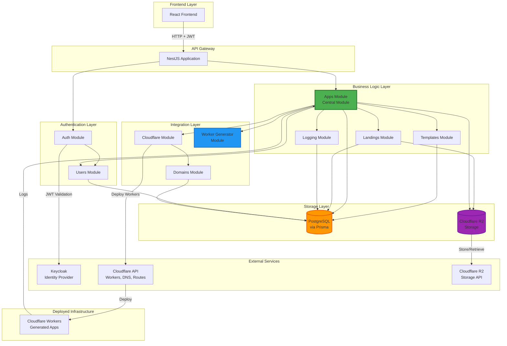
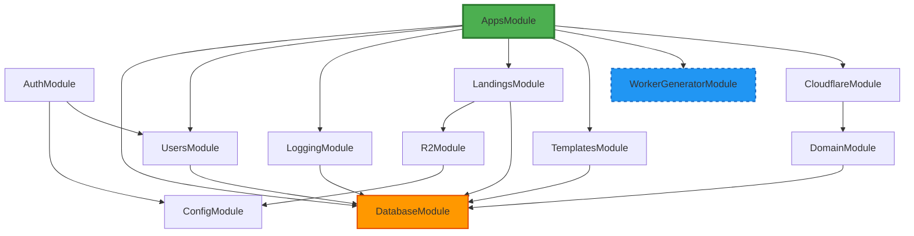
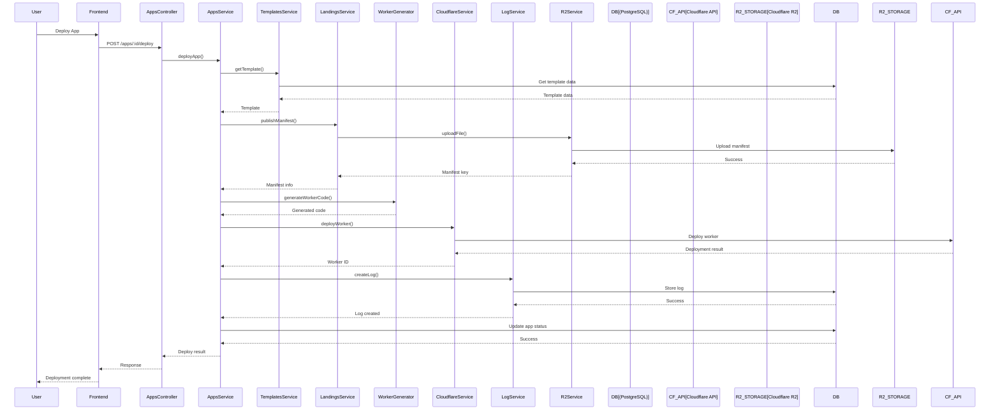
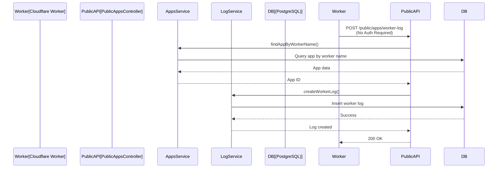
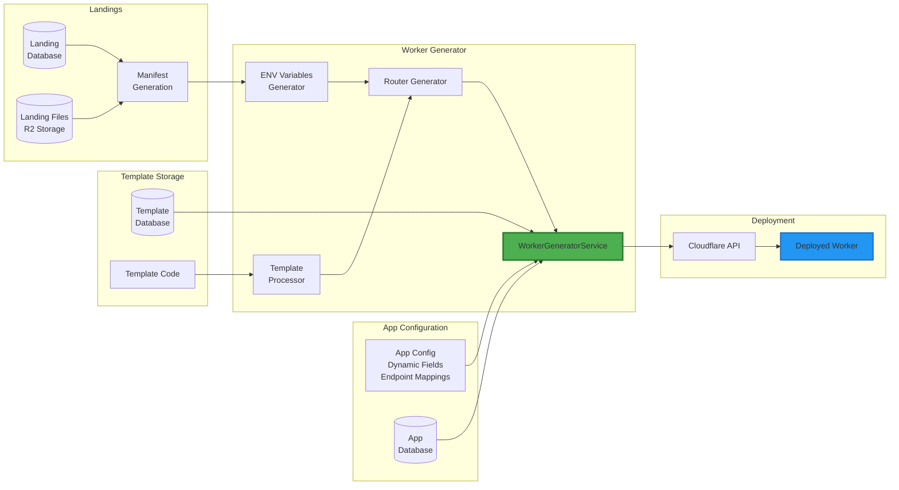

## 📐 Діаграми архітектури

### Діаграма загальної архітектури системи

### Діаграма залежностей модулів

### Діаграма послідовності: Деплой застосунку

### Діаграма послідовності: Збір логів від воркера

### Діаграма компонентів: Архітектура деплою

---
