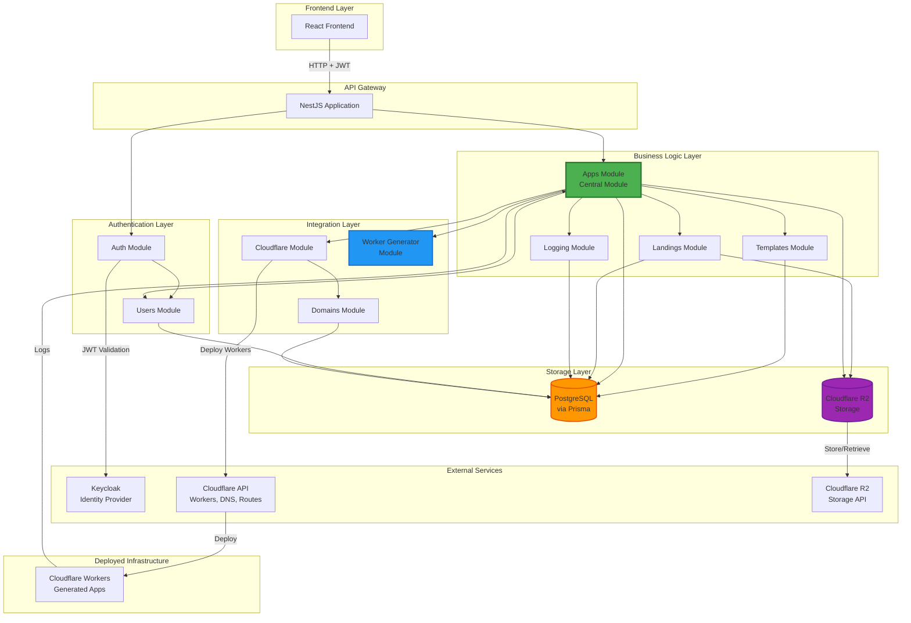

### Діаграма загальної архітектури системи

```mermaid
graph TB
    subgraph "Frontend Layer"
        FE[React Frontend]
    end

    subgraph "API Gateway"
        API[NestJS Application]
    end

    subgraph "Authentication Layer"
        AUTH[Auth Module]
        USERS[Users Module]
        AUTH --> USERS
    end

    subgraph "Business Logic Layer"
        APPS[Apps Module<br/>Central Module]
        TEMPLATES[Templates Module]
        LANDINGS[Landings Module]
        LOGGING[Logging Module]
    end

    subgraph "Integration Layer"
        CF[Cloudflare Module]
        DOMAINS[Domains Module]
        WG[Worker Generator<br/>Module]
        CF --> DOMAINS
    end

    subgraph "Storage Layer"
        DB[(PostgreSQL<br/>via Prisma)]
        R2[(Cloudflare R2<br/>Storage)]
    end

    subgraph "External Services"
        KC[Keycloak<br/>Identity Provider]
        CF_API[Cloudflare API<br/>Workers, DNS, Routes]
        CF_R2[Cloudflare R2<br/>Storage API]
    end

    subgraph "Deployed Infrastructure"
        WORKERS[Cloudflare Workers<br/>Generated Apps]
    end

    FE -->|HTTP + JWT| API
    API --> AUTH
    API --> APPS

    APPS --> TEMPLATES
    APPS --> LANDINGS
    APPS --> LOGGING
    APPS --> CF
    APPS --> WG
    APPS --> USERS

    LANDINGS --> R2
    APPS --> R2

    TEMPLATES --> DB
    APPS --> DB
    LANDINGS --> DB
    LOGGING --> DB
    USERS --> DB
    DOMAINS --> DB

    AUTH -->|JWT Validation| KC
    CF -->|Deploy Workers| CF_API
    R2 -->|Store/Retrieve| CF_R2

    CF_API -->|Deploy| WORKERS
    WORKERS -->|Logs| APPS

    style APPS fill:#4CAF50,stroke:#2E7D32,stroke-width:3px
    style WG fill:#2196F3,stroke:#1565C0,stroke-width:2px
    style DB fill:#FF9800,stroke:#E65100,stroke-width:2px
    style R2 fill:#9C27B0,stroke:#6A1B9A,stroke-width:2px
```
